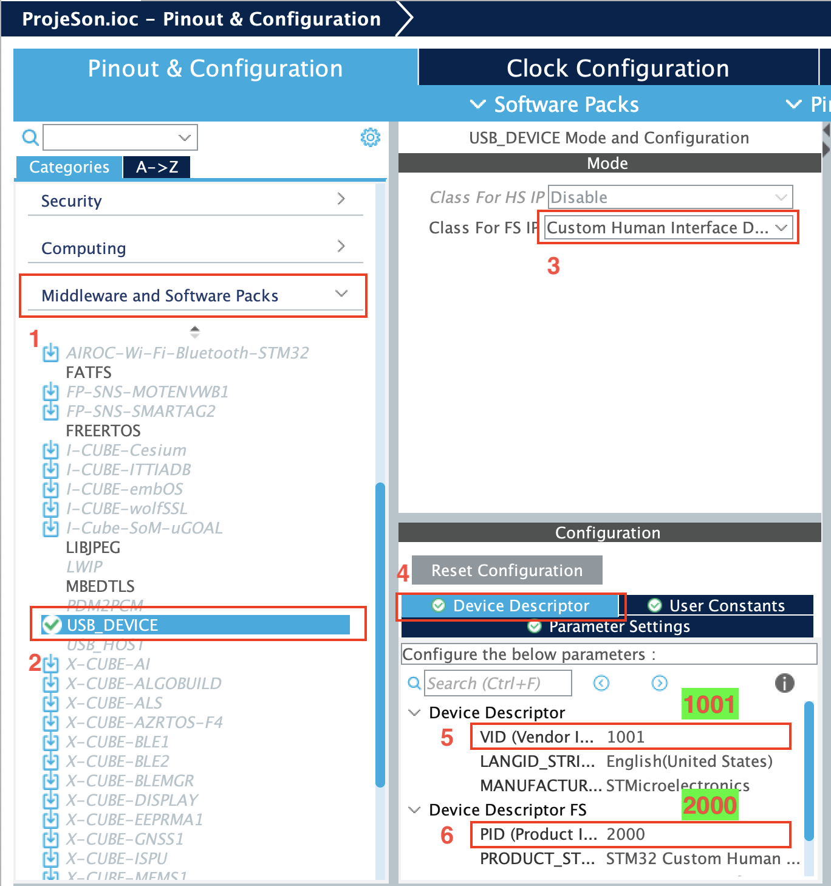

<br/>
<p align="center">
  <a href="https://github.com/ebekirbayar/STM32F407-and-USB-HID-Communication-Windows-Form-App">
    
  </a>

  <h3 align="center">STM32F407 and USB HID Communication Windows Form App</h3>

  <p align="center">
    "STM32F407 and USB HID Communication Windows Form App" is a GitHub repository containing firmware for STM32F407 microcontroller and a Windows Form application for communication via USB HID (Human Interface Device) protocol. It facilitates reliable data exchange between the microcontroller and a computer, serving as a valuable resource for understanding and implementing USB HID communication.
    <br/>
    <br/>
    <a href="https://github.com/ebekirbayar/STM32F407-and-USB-HID-Communication-Windows-Form-App">View Demo</a>
    .
    <a href="https://github.com/ebekirbayar/STM32F407-and-USB-HID-Communication-Windows-Form-App/issues">Report Bug</a>
    .
    <a href="https://github.com/ebekirbayar/STM32F407-and-USB-HID-Communication-Windows-Form-App/issues">Request Feature</a>
  </p>
</p>

   

## Table Of Contents

* [About the Project](#about-the-project)
* [Built With](#built-with)
* [Getting Started](#getting-started)
  * [Prerequisites](#prerequisites)
  * [Installation](#installation)
* [Contributing](#contributing)
* [License](#license)
* [Authors](#authors)

## About The Project

### Key Features:

* Custom USB HID Protocol: Implements a custom HID protocol tailored for efficient and reliable data exchange between the STM32F407 microcontroller and Windows device.

* Bidirectional Communication: Facilitates seamless two-way communication, empowering users to transmit and receive data between the microcontroller and Windows device.

* Configurable Setup: Streamlines setup procedures by providing pre-configured settings, minimizing configuration complexities and accelerating integration efforts.

* Modular Architecture: Features a modular design that promotes flexibility and extensibility, allowing easy integration with diverse project environments and requirements.

* Thorough Documentation: Offers comprehensive documentation, including setup instructions, configuration guidelines, and usage examples, to support users throughout the integration and utilization processes effectively.

## Built With

##### This project leverages the following technologies and tools:

* STM32CubeMX: Utilized for configuring and initializing the STM32F407 microcontroller, including peripheral setup and pin assignments.

* Keil µVision IDE: Used for firmware development, debugging, and building the STM32F407 firmware.

* C# (Visual Studio): Employed for developing the Windows Form application, enabling user-friendly interaction with the microcontroller.

* USB HID Protocol: Custom HID protocol implemented for efficient and reliable communication between the microcontroller and Windows device.

* .NET Framework: Provides the foundation for developing the Windows Form application, offering rich features and functionality for user interface development.

* GitHub: Used for version control, collaboration, and project management, facilitating seamless integration and development workflows.

* Documentation Tools: Markdown for creating comprehensive documentation within the repository, ensuring clarity and accessibility for users.

## Getting Started

#### Setup:
* Clone or download this repository to your local machine.
* Follow detailed setup instructions provided in the documentation to configure both the STM32F407 microcontroller and the Windows Form app.
#### Integration:
* After configuring the settings, download the Windows Form app from the designated GitHub repository.
Integrate the Windows Form app with the STM32F407 device following the integration guidelines provided.
#### Communication:
* Connect the STM32F407 microcontroller to the Windows device via USB.
* Launch the Windows Form app and initiate bidirectional communication with the microcontroller.
Utilize provided APIs and interfaces to facilitate data exchange according to project requirements.

### Prerequisites

##### Before proceeding, ensure you have the following:

* STM32CubeMX: Install STM32CubeMX for configuring the STM32F407 microcontroller.

* Visual Studio: Install Visual Studio for developing the Windows Form application.

* .NET Framework: Ensure that the .NET Framework is installed on your system.

* Hardware Setup: Connect the STM32F407 microcontroller to your Windows device via USB.

### Installation

#### Step 1: Setup Development Environment

1. Install STM32CubeIDE: Download and install STM32CubeIDE from the official STMicroelectronics website. STM32CubeIDE is used for configuring and initializing the STM32F407 microcontroller.

2. Install Visual Studio: Download and install Visual Studio for developing the Windows Form application. Ensure that the .NET Framework is installed as well.

#### Step 2: Configure Microcontroller Firmware

* Clone the repo

```sh
git clone https://github.com/ebekirbayar/STM32F407-and-USB-HID-Communication-Windows-Form-App.git
```

<p align="center">

<br/>

<br/>

<br/>

<br/>

<br/>

<br/>

<br/>

<br/>

<br/>

<br/>
</p>


#### Step 3: Integrate Windows Form Application

* Clone Repository: Clone or download the STM32F407 and USB HID Communication Windows Form App repository from GitHub to your local machine.

* Clone the repo

```sh
git clone https://github.com/ebekirbayar/RFID-Card-Access-Management-with-STM32F407-and-USB-HID-Communication-Windows-Form-Integration.git
```

## Contributing

Contributions are what make the open source community such an amazing place to be learn, inspire, and create. Any contributions you make are **greatly appreciated**.
* If you have suggestions for adding or removing projects, feel free to [open an issue](https://github.com/ebekirbayar/STM32F407-and-USB-HID-Communication-Windows-Form-App/issues/new) to discuss it, or directly create a pull request after you edit the *README.md* file with necessary changes.
* Please make sure you check your spelling and grammar.
* Create individual PR for each suggestion.
* Please also read through the [Code Of Conduct](https://github.com/ebekirbayar/STM32F407-and-USB-HID-Communication-Windows-Form-App/blob/main/CODE_OF_CONDUCT.md) before posting your first idea as well.

### Creating A Pull Request


## License

Distributed under the MIT License. See [LICENSE](https://github.com/ebekirbayar/STM32F407-and-USB-HID-Communication-Windows-Form-App/blob/main/LICENSE) for more information.

## Authors

* **Ebubekir BAYAR** - *Computer Engineer* - [Ebubekir BAYAR](https://github.com/ebekirbayar/)
